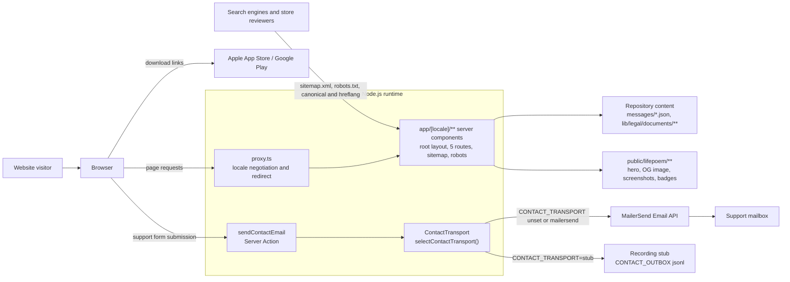

# LifePoem Website — System Design

## 1. Overview

The LifePoem website is a multilingual public-facing companion to the LifePoem mobile app. It introduces the product, directs visitors to the app stores, publishes legal and account-deletion information, and accepts support messages.

The website is implemented as a single Next.js application. Content lives in the repository, all page markup is produced by server components, and a server-side contact action hands support messages to an email transport. There is no application database, authentication system, or background worker in this repository.

This document describes the implementation inspected on **13 September 2026**, after the website revamp. It records the site as built, including the places where it is knowingly incomplete. `docs/specs/website-revamp.md` states what was asked for and `docs/deviations.md` records where the build departs from the design prototype; this document describes what exists.

## 2. System Context



Fonts are self-hosted through `next/font`, so there is no browser-time request to a font CDN. The mobile application's account processing, story storage, AI features, and deletion jobs are described in published legal content but are implemented outside this website. The `/delete-account` page provides instructions; it does not execute account deletion.

## 3. Technology Stack

| Area | Implementation |
| --- | --- |
| Web framework | Next.js 16.2.4, App Router |
| UI | React 19.2.4 and React DOM 19.2.4 |
| Language | TypeScript 5, `strict`, `@/*` path alias declared in `tsconfig.json` |
| Styling | Tailwind CSS 4 through `@tailwindcss/postcss`; design tokens in an `@theme` block in `app/globals.css` |
| Internationalization | Custom: locale-prefixed routes, JSON dictionaries, server components taking dictionary slices |
| Email | MailerSend HTTP API through Node.js `https`, behind a `ContactTransport` seam |
| Images | Local assets rendered with `next/image` |
| Fonts | Five families self-hosted through `next/font/google`. Geist has been removed |
| Tests | Playwright (`@playwright/test` ^1.63.0) in two configs — the stubbed main suite and a separate live-send config; plus a locale-parity script |
| Checks | ESLint 9 with `eslint-config-next` core-web-vitals and typescript configs; `tsc --noEmit` |
| Hosting | Vercel, configured in `vercel.json`, region `sin1` |
| CI | GitHub Actions, `.github/workflows/web.yml` |
| Package management | npm with `package-lock.json` |

`next.config.ts` contains exactly one piece of configuration: an async `redirects()` returning the two `/support` aliases. There is no image-domain, header, rewrite or experimental configuration in it; HTTP headers are set in `vercel.json` instead.

## 4. Application Structure

```text
app/
  globals.css                   Tailwind import, @theme tokens, base layer, legal-rail rule
  favicon.ico
  robots.ts                     robots.txt
  sitemap.ts                     sitemap.xml with per-URL hreflang alternates
  [locale]/
    layout.tsx                  ROOT layout: html/body, fonts, locale guard, metadata
    page.tsx                    Landing page
    contact/
      page.tsx                  Support page: notice, form, aside panels
      actions.ts                "use server" — sendContactEmail and its result types
    privacy/page.tsx            Thin wrapper over the shared legal shell
    terms/page.tsx              Thin wrapper over the shared legal shell
    delete-account/page.tsx     Thin wrapper over the shared legal shell
components/
  site/                         site-header, site-footer, locale-menu, store-badges, section-heading
  home/                         hero, how-it-works, pace, gallery + screenshot-gallery, example-story, download
  contact/contact-form.tsx      The only client component on the support route
  legal/                        legal-page (shell + metadata), legal-document-view (rendering + rail)
lib/
  i18n/                         config, dictionary type, server-only loader, interpolate
  contact/                      contact-transport (the seam), mailersend-transport, recording-transport, select-transport
  legal/                        typed documents, locale lookup, contact notice, heading slugifier
  mailersend/post-json-https.ts Node https POST with timeout
  site.ts                       Origin, localised route list, absolute URLs, hreflang map
messages/                       en.json (source of truth), zh.json, ms.json, ta.json
public/lifepoem/                Hero crop, OG image, ten screenshots, two store badges
design-assets/                  Unserved source artwork (hero-source.png) plus its regeneration notes
scripts/
  check-locale-parity.mjs       Key paths, array lengths and {placeholder} parity
  test-mailersend-api.mjs       Direct MailerSend API smoke test
  install-play-badge.sh         Guided acquisition of the official Play badge
e2e/                            The main Playwright suite and its shared helpers
e2e-live/                       One spec that really sends, run deliberately
playwright.config.ts            Main suite: port 3100, mail transport stubbed
playwright.live.config.ts       Live send: port 3101, real provider
proxy.ts                        Locale negotiation and locale-prefix redirects
docs/                           design-system.md, responsive-and-handoff.md, deviations.md, specs/
```

`components/i18n/` remains on disk as an empty directory, left over from the removed translations context; it contains no files.

**There is no `app/layout.tsx`.** The root layout lives at `app/[locale]/layout.tsx`, which is what allows `<html lang>` to be correct in the server-rendered HTML instead of being patched after hydration. **There is no `middleware.ts`**; `proxy.ts` replaces it.

### Responsibilities and boundaries

- **Routes and layouts** validate the locale parameter, load content, define metadata, and compose server components.
- **Sections** are server components that receive the dictionary slice they render and nothing else, for example `HeroSection({ hero, store })`.
- **Client components** are limited to the five modules that need browser state; see §6.
- **Internationalization** centralizes the locale list, the BCP 47 mapping, the `Dictionary` type and the server-only dictionary loader.
- **Legal content** uses typed data and one shared shell and renderer, so all three documents and all four locales share one presentation.
- **The contact action** owns validation and returns a typed outcome; it does not know which transport is in use.
- **The transport seam** owns provider choice, credential reading and the production guard. The MailerSend adapter owns the provider payload; the `https` helper owns network transport and timeout.

## 5. Routing and Internationalization

### Public routes

Each page is available under four locale prefixes: `en` (English), `zh` (Simplified Chinese), `ms` (Malay), and `ta` (Tamil). The list is declared once, in `localisedRoutes` in `lib/site.ts`, and reused by the sitemap, the hreflang map and the end-to-end suite.

| Route | Purpose |
| --- | --- |
| `/{locale}` | Product landing page |
| `/{locale}/contact` | Support form |
| `/{locale}/privacy` | Privacy policy |
| `/{locale}/terms` | Terms of service |
| `/{locale}/delete-account` | Account and data deletion instructions |
| `/sitemap.xml` | Generated by `app/sitemap.ts` |
| `/robots.txt` | Generated by `app/robots.ts` |

Two permanent redirects are declared in `next.config.ts`, because both URLs are already registered in store consoles:

| Source | Destination | Kind |
| --- | --- | --- |
| `/support` | `/contact` | 308 permanent |
| `/{en,zh,ms,ta}/support` | `/{locale}/contact` | 308 permanent |

The prefix-less forms `/support` and `/delete-account` resolve because the redirect and the locale proxy compose: `/support` redirects to `/contact`, which the proxy then prefixes with the negotiated locale.

### Locale selection

`proxy.ts` exports a `proxy(request)` function and a matcher. It runs on the Node.js runtime; the edge runtime is not available under the proxy convention.

1. If the first path segment is a supported locale, the request passes through untouched.
2. Otherwise a locale is negotiated. The `NEXT_LOCALE` cookie is consulted first: an explicit choice beats the browser's preference, so a returning visitor is not re-negotiated.
3. Failing that, `Accept-Language` is parsed **quality-weighted**: every entry is split into tag and `q` value, missing `q` defaults to 1, and the list is sorted by descending quality. The first entry that equals a supported locale or begins with `{locale}-` wins. A header of `en;q=0.5,zh-CN;q=0.9` therefore resolves to `zh`, which the previous first-entry implementation got wrong.
4. With no header and no cookie, the fallback is `en` (`defaultLocale`).
5. The response is a redirect to the locale-prefixed pathname with the original query string preserved.

The matcher excludes `_next/static`, `_next/image`, `favicon.ico`, `sitemap.xml`, `robots.txt`, and any path ending in `.svg`, `.png`, `.jpg`, `.jpeg`, `.gif`, `.webp` or `.ico`. Other static file types are not exempted.

The cookie is written client-side by `LocaleMenu` (`path=/`, `max-age=31536000`, `samesite=lax`). It is a preference, not a credential.

### Dictionaries and the type contract

- `lib/i18n/dictionary.ts` derives the type directly from the English file: `export type Dictionary = typeof en`, importing `messages/en.json`. A key present in `en.json` but missing from a component's props, or a component reading a key that does not exist, is a **build error**.
- `lib/i18n/get-dictionary.ts` is marked `server-only` and dynamically imports one of the four JSON files, typed as `Dictionary`. Because `zh.json`, `ms.json` and `ta.json` are loaded through that same `Record<Locale, () => Promise<Dictionary>>`, a structurally divergent locale file fails typechecking rather than rendering a hole at runtime.
- **The React context provider and the `t()` dot-path helper are gone.** There is no `TranslationsProvider` and no runtime key lookup. Sections receive slices as props. The only remaining string operation is `interpolate(template, vars)` in `lib/i18n/interpolate.ts`, which fills `{name}` placeholders with `replaceAll`.
- `npm run check:locales` (`scripts/check-locale-parity.mjs`) complements the type check with the two things types cannot see: it compares the full key-path shape of each locale against `en.json` **including array lengths** (`array(6)` versus `array(5)`), reports unexpected extra paths, and verifies that the set of `{placeholder}` names in every string **survives translation**. It exits non-zero with one line per problem.
- There is no runtime fallback to English for a missing string, and none is needed: a missing key cannot reach runtime.

### Rendering and metadata

- The root layout declares all four locale values through `generateStaticParams` and calls `notFound()` for anything else, so `/de` is a 404.
- `<html lang>` is rendered on the server from `localeToHtmlLang(locale)`, which maps `zh` to `zh-CN` and passes the others through. The element also carries `data-scroll-behavior="smooth"` — required from Next.js 16 onward for the router to respect `scroll-behavior: smooth` — plus the five font variable classes and `suppressHydrationWarning`.
- All five routes are built from local files and are eligible for prerendering. **The contact route is no longer forced dynamic:** it reads no `searchParams` and declares no `dynamic` export. `LocaleMenu` deliberately avoids `useSearchParams` — reading the query and hash from `window.location` in its click handler instead — precisely so that every page carrying the header stays statically renderable.
- `app/sitemap.ts` declares `dynamic = "force-static"` and `revalidate = false`.
- Metadata is composed per route; see §11.

## 6. Landing Page and Presentation

`app/[locale]/page.tsx` composes the page in this order:

1. `SiteHeader` — sticky, with desktop nav, the language menu and a mobile disclosure panel.
2. `HeroSection` — eyebrow, `h1`, lead, store badges, an anchor to `#how-it-works`, an availability line, and the framed 4:5 hero image with an overlaid life-stage chip.
3. `HowItWorks` (`#how-it-works`) — three numbered steps, each with a title, body and aside.
4. `PaceSection` — copy plus one bordered list of five features, deliberately not five cards.
5. `GallerySection` (`#inside-the-app`) — section heading plus `ScreenshotGallery`.
6. `ExampleStory` — the illustrative sample story with Prose / Diary / Letter tabs.
7. `DownloadSection` (`#download`) — the dark panel with both store badges and the language line.
8. `SiteFooter` — brand blurb, four information links, the language pills, and the copyright line.

The download buttons link to:

- Apple App Store: `https://apps.apple.com/sg/app/life-poem/id6766281573`
- Google Play: `https://play.google.com/store/apps/details?id=one.lifepoem.android`

Both are declared once as `APP_STORE_URL` and `PLAY_STORE_URL` in `components/site/store-badges.tsx`, rendered `target="_blank" rel="noreferrer"`, with the accessible name on the link and an empty `alt` on the decorative badge image.

### Client components

Exactly five modules declare `"use client"`, and each owns one piece of browser state:

| Component | Why it is a client component |
| --- | --- |
| `components/site/site-header.tsx` | Mobile menu open/closed |
| `components/site/locale-menu.tsx` | Menu open/closed, keyboard handling, cookie write, `router.push` |
| `components/home/screenshot-gallery.tsx` | Selected slide, `prefers-reduced-motion` query, swipe gesture |
| `components/home/example-story.tsx` | Selected story format |
| `components/contact/contact-form.tsx` | `useActionState`, pending state, character counter |

Everything else — every home section wrapper, the footer, both legal components, all five pages and the layout — is a server component. (`docs/deviations.md` says "four client components"; the count on disk is five, `LocaleMenu` being the one it folds into the header.)

### Styling

Styling is **Tailwind v4 theme tokens declared in `app/globals.css`**, not arbitrary CSS-variable values at call sites. Call sites write `bg-parchment`, `text-ink`, `rounded-card`, `shadow-card`, `min-h-tap-xl`. The `@theme` block defines:

- **Surfaces**: `parchment`, `card`, `paper`, `tint`, `rule`, `edge` (borders only, never text).
- **Brand and text**: `brand` (7.4:1 on white), `brand-hover`, `ink` (11.6:1), `muted` (6.9:1), `faint` (placeholders only).
- **Dark panel**: `dark`, `dark-edge`, `on-dark`, `on-dark-accent`.
- **Status**: `error`/`error-bg`/`error-edge`/`error-ink` and the `success` equivalents. Status is never colour alone; both the error alert and the success panel pair colour with an icon and wording.
- **Type scale** with per-token line height and letter spacing: `display`, `section`, `page`, `panel`, `card`, `slide`, `lead` (21px), `body` (19px), `row` (18px), `small` (16px), `eyebrow`, `label`. Body copy does not drop below 18px; 16px is the help-text and footnote floor.
- **Radii** (`control`, `field`, `action`, `panel`, `media`, `card`, `frame`, `phone`), **brown-tinted shadows** (`card`, `form`, `frame`, `overlay`), **touch-target spacing** (`tap` 44px, `tap-lg` 56px, `tap-xl` 64px) and **container widths** (`shell` 1240, `section` 1160, `narrow` 1040, `panel` 820).

A separate `@theme inline` block maps the font tokens (`font-display`, `font-body`, `font-display-zh`, `font-body-zh`, `font-body-ta`) onto the CSS variables emitted by `next/font`; `inline` is required because those variables are defined outside the block.

The base layer sets the page background and body font, gives Chinese (`html[lang^="zh"]`) and Tamil (`html[lang^="ta"]`) their own families and larger line heights, keeps the wordmark in the Latin serif, sets a global `3px` focus ring at `3px` offset on `*:focus-visible`, sets `:target { scroll-margin-top: 96px }` so the sticky header cannot hide a jumped-to heading, and collapses all animation and transition durations under `prefers-reduced-motion: reduce`. The gallery additionally checks `prefers-reduced-motion` in JavaScript, because its transform transition is applied inline. `docs/design-system.md` carries the annotated token table with contrast ratios.

### Fonts

Five families, all self-hosted by `next/font/google` and declared in the root layout:

| Family | Configuration | Preloaded |
| --- | --- | --- |
| `Source_Serif_4` | `latin` subset, `--font-source-serif-4`, `display: swap` | yes |
| `Source_Sans_3` | `latin`, weights 400/500/600/700, `--font-source-sans-3` | yes |
| `Noto_Serif_SC` | weights 500/700, `--font-noto-serif-sc` | **no** |
| `Noto_Sans_SC` | weights 400/500/700, `--font-noto-sans-sc` | **no** |
| `Noto_Sans_Tamil` | weights 400/500/700, `--font-noto-sans-tamil` | **no** |

The CJK and Tamil families set `preload: false` deliberately: preload defaults to on, and preloading a Chinese webfont on every English page costs far more than it saves. They still load through the `html[lang^=…]` CSS rules on the locales that use them. **Geist is gone** — the revamped design does not use it — and so is the render-blocking third-party Google Fonts stylesheet import. One stale comment in `app/globals.css` still points at `app/layout.tsx` for the font setup; the file is `app/[locale]/layout.tsx`.

### Screenshot gallery

Image order is `SCREENSHOT_PATHS` in `components/home/screenshot-gallery.tsx`, ten local WebP files under `public/lifepoem/screenshots/`, sequenced as a walkthrough rather than by filename. It is **index-aligned** with the `gallery.slides` array in every locale file, which supplies each slide's `title`, `body` and `alt`; the parity script's array-length check exists to catch drift between them.

The selected slide is local React state. Previous/next wrap around, indicator buttons jump directly, `ArrowLeft`/`ArrowRight`/`Home`/`End` work on the focusable region, and a swipe is honoured only when horizontal travel exceeds 48px within 300ms and exceeds the vertical component. Off-screen slides carry `aria-hidden`, position is announced through an `aria-live="polite"` line, the first image sets `preload`, and the indicator buttons are `size-tap` (44px) with a smaller visual pill inside.

## 7. Legal Pages

The three legal routes — `/privacy`, `/terms`, `/delete-account` — are near-identical three-line files. Each exports `generateMetadata` delegating to `legalMetadata(kind, locale)` and a default component delegating to `<LegalPage kind localeParam>`. **All shared behaviour lives once** in `components/legal/legal-page.tsx`, which holds the `LegalKind` union, the `DOCUMENTS` map from kind to document getter, the `ROUTES` map from kind to `LocalisedRoute`, the locale guard, and the header/footer shell.

`components/legal/legal-document-view.tsx` renders the document: breadcrumb (home, title, optional cross-link to the sibling document), `h1`, optional effective date, optional intro split on blank lines, then each section as an `h2` with optional paragraphs and bullets, then the optional closing note and a back-home link. All content is rendered as React text; no HTML is injected.

**Anchors are derived, not stored.** `slugifyHeading(title, index)` lowercases the heading, replaces runs of non-letter/non-number characters with `-`, trims stray dashes, and falls back to `section-{n}` if nothing survives. It keeps Unicode letters (`\p{L}`, `\p{N}`), so Chinese and Tamil headings produce real ids instead of collapsing to empty strings. This exists so that **the twelve approved legal files under `lib/legal/documents/` stay unmodified**: `LegalDocument` has no id field, and adding one would mean editing approved copy. The trade-off is that editing a heading changes its fragment; nothing outside the site links to these fragments.

The contents rail is **a single `<details>` element at every width**, inside one `nav aria-label="On this page"`. Above 900px a CSS rule in `app/globals.css` forces it open — `details.legal-contents > *:not(summary) { display: block }`, overriding the user-agent rule that hides a closed `details`' content — removes the marker and disables pointer events on the summary, so it reads as a sticky desktop rail. Below 900px it is a real disclosure. One element, one set of links, no JavaScript and no duplicated navigation landmark.

## 8. Content and Data Model

### Repository-managed content

| Data | Location | How it changes |
| --- | --- | --- |
| Interface and marketing copy | `messages/{locale}.json` | Source edit and deployment |
| Legal documents | `lib/legal/documents/{privacy,terms,delete-account}/{locale}.ts` | Source edit and deployment (approved copy: style only) |
| Contact PDPA notice | `lib/legal/contact-notice.ts` | Source edit and deployment (approved wording, quoted verbatim) |
| Screenshot assets | `public/lifepoem/screenshots/` | Asset update, with the caption arrays kept aligned |
| Store destinations | `components/site/store-badges.tsx` | Source edit and deployment |
| Canonical origin | `NEXT_PUBLIC_SITE_URL`, default `https://lifepoem.one` | Environment |

`en.json` has fourteen top-level groups: `meta`, `localeNames`, `brand`, `nav`, `hero`, `store`, `howItWorks` (3 steps), `pace` (5 features), `gallery` (6 slides), `example` (3 samples), `download`, `footer`, `legal`, `contact`, `a11y`. `LegalDocument` contains a title, description, optional effective date and intro, ordered sections with optional paragraphs or bullets, an optional cross-link, and an optional closing note.

### Transient contact data

The support form submits `name`, `email`, `message`, and a hidden honeypot field named `website`. The server trims all three values and uses a valid submission to build a plain-text email. **The website has no persistence layer for submissions**; the only durable copies are in the email provider and the support mailbox. In a stubbed test run, the recording transport appends a JSON line to `CONTACT_OUTBOX` (`.contact-outbox.jsonl`, gitignored) instead.

## 9. Contact Submission Flow

This is the part of the site that changed most. The Server Action **returns a typed result union** consumed by `useActionState`; the old `?status=` query-parameter redirect is gone, which is why the route no longer opts out of static rendering and why a refresh no longer re-displays a stale success message.

```mermaid
sequenceDiagram
    participant Browser as Browser - ContactForm with useActionState
    participant Action as sendContactEmail Server Action
    participant Select as selectContactTransport
    participant Transport as ContactTransport
    participant API as MailerSend API or outbox file

    Browser->>Action: FormData: name, email, message, website
    Action->>Action: honeypot check on "website"
    alt honeypot filled
        Action-->>Browser: { status: "sent" }
        Note over Action,Browser: Nothing is sent. A bot cannot tell it was caught.
    else honeypot empty
        Action->>Action: trim values, validate
        alt field errors
            Action-->>Browser: { status: "invalid", fieldErrors, values }
            Note over Browser: Per-field messages plus a summary alert;<br/>typed values echoed back into the inputs.
        else valid
            Action->>Select: choose transport from CONTACT_TRANSPORT
            alt configuration refused
                Select--xAction: ContactTransportUnavailableError
            else configured
                Select-->>Action: transport
                Action->>Transport: deliver({ toEmail, replyToEmail, subject, text })
                Transport->>API: POST /v1/email over HTTPS, or append to outbox
            end
            alt accepted
                API-->>Transport: 2xx / write succeeded
                Action-->>Browser: { status: "sent" }
            else rejected, network failure, timeout, or misconfiguration
                Action->>Action: console.error with the reason only
                Action-->>Browser: { status: "failed", values }
            end
        end
    end
```

### The result union

`app/[locale]/contact/actions.ts` exports the shapes the form consumes:

```ts
type ContactValues = { name: string; email: string; message: string };
type ContactFieldErrors = { name?: "required"; email?: "invalid"; message?: "tooShort" };

type ContactResult =
  | { status: "idle" }
  | { status: "sent" }
  | { status: "invalid"; fieldErrors: ContactFieldErrors; values: ContactValues }
  | { status: "failed"; values: ContactValues };
```

Field errors are **codes, never prose** — the form maps `"required"`, `"invalid"` and `"tooShort"` onto `content.nameError`, `content.emailError` and `content.messageError`, so the message is localized on the rendering side. `MESSAGE_MIN_LENGTH` (10) is exported from the action and reused as the textarea's `minLength`, so the client and server agree on one number.

### The three outcomes

| Outcome | What the visitor sees |
| --- | --- |
| `sent` | The form is **replaced** by a `role="status"` panel: a ✓ badge, `contact.successHeading`, `contact.successBody`, and a "Send another message" link to `?` that reloads the route with a fresh form. |
| `invalid` | The form re-renders with a `role="alert"` summary (`contact.invalidMessage`) plus a per-field message under each failing field; each failing input gets `aria-invalid="true"` and an error border. |
| `failed` | The form re-renders with a `role="alert"` carrying `contact.failureMessage` **and** `contact.failureFallback`, which names the support address so the visitor has another route in. |

**Delivery failure is deliberately distinct from invalid input.** `failed` says the provider would not accept the message and offers the mailbox address; `invalid` says to check the details. They render different wording, and an end-to-end test asserts the failure state does *not* contain the validation wording. In the previous version both collapsed into one generic error message.

**Submitted values are echoed back.** `invalid` and `failed` both carry `values`, and the form feeds them to each input's `defaultValue`, so a rejected attempt never makes anyone retype a long message. `sent` and `idle` carry no values.

### Validation

- The honeypot is checked **first**, before trimming or validation, so it costs nothing.
- `name` must be non-empty after trimming.
- `email` must match `/^[^\s@]+@[^\s@]+\.[^\s@]+$/`. This is a shape check, not a deliverability check.
- `message` must be at least 10 characters after trimming.
- Validation always runs on the server. The form sets `noValidate`, so the browser's own constraint UI is suppressed and the server is the only gate; `required`, `type="email"` and `minLength` remain on the inputs as semantics for assistive technology.
- There is **no maximum length** on any field.

### Honeypot behaviour

The field is `<input id="lp-website" name="website" tabIndex={-1} autoComplete="off">` with a real `<label>` reading `contact.honeypotLabel` ("Website"), inside a container that is `aria-hidden="true"` and **visually hidden by clipping** (`absolute size-px overflow-hidden [clip:rect(0_0_0_0)]`) rather than `display: none` — a bot that fills every field it can see in the DOM still trips it. When it is filled the action returns `{ status: "sent" }` without constructing or delivering a message, so the response is indistinguishable from a real success.

### Form ergonomics

`useActionState` supplies `pending`: the submit button is disabled, swaps `contact.ctaSend` for `contact.ctaSending`, and shows a spinner (`@keyframes lp-spin`) while in flight, which also prevents a double submission from a second press. A live character counter tracks the trimmed message length against the 10-character minimum. Every field puts its help text **above** the input and wires it with `aria-describedby`, so it is read before the visitor types. The submit control is `min-h-tap-xl` (64px).

### Logging

On failure the action logs `"Support email delivery failed:"` plus the error message only. **It never logs the message body or the visitor's address.** The reason is enough to diagnose a bad token or an unverified sending domain.

## 10. Email Transport

The seam is `lib/contact/contact-transport.ts`:

```ts
type ContactMessage = { toEmail: string; replyToEmail: string; subject: string; text: string };
type ContactTransport = { deliver: (message: ContactMessage) => Promise<void> };
class ContactDeliveryError extends Error {}
```

Everything above the seam is exercised by a real browser over HTTP; everything below it is either the real provider or the recording stub. There is deliberately no third implementation and **no test-only branch anywhere above the seam**.

### MailerSend implementation

`createMailerSendTransport({ apiToken, fromEmail })` POSTs JSON to `https://api.mailersend.com/v1/email` with bearer authentication. The sender is `{ email: fromEmail, name: "LifePoem Website" }`, `reply_to` is the visitor's address, the subject is `New Contact Message from {name}`, and the body is plain text containing the name, email and message. `lib/mailersend/post-json-https.ts` performs the request with `node:https`, sets `Content-Length`, buffers the response, and destroys the request after **60 seconds**. Any non-2xx status throws a `ContactDeliveryError` naming the status and the first 500 characters of the response body — that body is what tells you a sending domain is unverified — and never the token.

There is no queue, retry policy, idempotency key, or delivery-status webhook. Success means the API accepted the message, not that it reached an inbox.

### Recording stub

`createRecordingTransport(outboxPath, delayMs)` appends `{...message, recordedAt}` as one JSON line to `outboxPath` instead of sending. Two details exist for the test suite: an optional delay (`CONTACT_STUB_DELAY_MS`) so the in-flight state is observable, and a rejection when the reply-to address matches `/fail/i`, which is how a spec reaches the delivery-failure outcome without breaking anything real.

### Transport selection and the production guard

`selectContactTransport()` in `lib/contact/select-transport.ts` is `server-only` and reads `CONTACT_TRANSPORT`, **defaulting to `"mailersend"`** — a deployment that sets nothing sends real email.

- `CONTACT_TRANSPORT=stub` **is refused under `NODE_ENV=production` unless `CONTACT_TRANSPORT_STUB_ACK` equals `i-understand-no-email-will-be-sent`.** The refusal **throws** a `ContactTransportUnavailableError`; it does not silently fall back to the real provider and it does not silently not send. The action catches it and renders the `failed` state, so a misconfigured deployment fails loudly and visibly instead of dropping support mail on the floor. The acknowledgement value is spelled out so it cannot be set by accident and reads unmistakably in a deployment's environment listing.
- Any value other than `mailersend` or `stub` throws.
- For `mailersend`, both `MAILERSEND_API_TOKEN` and `MAILERSEND_FROM_EMAIL` must be present, or it throws before any network call.
- `contactRecipient()` returns `CONTACT_TO_EMAIL`, defaulting to `support@lifepoem.one`.

Note one coupling: `contact.failureFallback` hard-codes `support@lifepoem.one` in copy in all four locales, so changing `CONTACT_TO_EMAIL` without editing the dictionaries would show visitors the wrong fallback address.

## 11. SEO and Metadata

The previous version of the site had **no canonical URLs, no hreflang alternates, no sitemap, no robots file and no OpenGraph or Twitter tags**. All of that now exists, derived from one origin.

`lib/site.ts` holds the derivation:

- `siteOrigin` = `NEXT_PUBLIC_SITE_URL` or `https://lifepoem.one`.
- `localisedRoutes` = `["", "/contact", "/privacy", "/terms", "/delete-account"]`.
- `absoluteUrl(locale, route)` and `languageAlternates(route)`, the latter returning `{ en, "zh-CN", ms, ta }` (BCP 47 tags, so Chinese is `zh-CN`) plus **`x-default`** pointing at the English URL.

| Surface | What is emitted |
| --- | --- |
| Root layout | `metadataBase`, localized title and description, canonical for `/{locale}`, the full `languages` map, OpenGraph (`type`, `siteName`, title, description, `url`, `locale` as the BCP 47 tag with `-` replaced by `_` — so `en`, `zh_CN`, `ms`, `ta` — and one 1200×630 image with localized alt), Twitter `summary_large_image` |
| `/{locale}/contact` | Localized title and description, canonical and alternates for `/contact` |
| The three legal routes | `legalMetadata(kind, locale)` uses the document's own `title` and `description`, plus canonical and alternates for that route |
| `/sitemap.xml` | Every locale × every localised route — 20 URLs — each with `lastModified`, `changeFrequency` (`monthly` for the home page, `yearly` otherwise), `priority` (1 / 0.6) and **per-URL `alternates.languages`** |
| `/robots.txt` | `User-Agent: *`, `Allow: /`, the sitemap URL, and `host` |

The OG and Twitter image is `public/lifepoem/og-image.webp`, a generated 1200×630 share image (142,468 bytes). `lastModified` in the sitemap is `new Date()` at generation time, not a content timestamp.

## 12. Testing

A Playwright suite is configured and is **the project's only test seam: the site over HTTP in a real browser.** Every assertion happens at that boundary. There is no unit-test framework and no component harness, and no test-only branch anywhere above the transport seam — the stub is selected by configuration, not by a conditional inside the action or the UI.

`playwright.config.ts` builds and serves the production app itself:

- `webServer.command` is `npm run build && npx next start --port 3100`, `url` `http://localhost:3100`, 240s boot timeout, `reuseExistingServer` unless `CI`.
- Two projects: `desktop` (Desktop Chrome) and `mobile` (Pixel 5). `fullyParallel`, 30s test timeout, 10s expect timeout, `trace: "on-first-retry"`; under CI, `forbidOnly`, 2 retries, 1 worker, the `github` reporter.
- The email path reaches the same seam **through configuration, not a second harness**: the server boots with `CONTACT_TRANSPORT=stub`, `CONTACT_TRANSPORT_STUB_ACK=i-understand-no-email-will-be-sent` (required, because `next start` sets `NODE_ENV=production` — the guard firing here is the point), `CONTACT_OUTBOX=.contact-outbox.jsonl`, `CONTACT_STUB_DELAY_MS=400`, `CONTACT_TO_EMAIL=support@lifepoem.one` and `NEXT_PUBLIC_SITE_URL=http://localhost:3100`. Specs drive the real form and then read the recorded payload back off disk through `e2e/support.ts`.

| Spec | What it covers |
| --- | --- |
| `e2e/routes.spec.ts` | All 20 locale × route combinations return 200, expose exactly one non-empty `h1`, and carry the right `html lang`; no page renders a raw dictionary key (every key path is enumerated from `en.json`); `/de` is a 404 |
| `e2e/contact.spec.ts` | Per-field errors and `aria-invalid`; only the failing field flagged; typed values surviving a rejection; a valid send producing exactly one recorded payload with the right recipient, reply-to, subject and body; the pending/disabled submit state; the delivery-failure state being distinct from validation and naming the support address; a filled honeypot reporting success and recording nothing; the character counter; label/help wiring; the 64px submit floor. Runs `serial` because the outbox is one shared file |
| `e2e/navigation.spec.ts` | Language switch preserving path, query and fragment; the `NEXT_LOCALE` cookie being written and then honoured on a prefix-less visit; Escape closing the menu and restoring focus; `/support`, `/{locale}/support` and `/delete-account` resolving; the footer deletion link in every locale; anchor targets clearing the sticky header; the mobile disclosure panel, its 44px+ rows, and no horizontal scroll at 390px |
| `e2e/gallery.spec.ts` | Button, dot, arrow/Home/End and swipe navigation with wrap-around; the live position announcement; off-screen slides hidden from assistive technology; ten captioned, alt-texted slides in every locale; a vertical drag not changing slides |
| `e2e/seo.spec.ts` | The sitemap listing all 20 URLs and containing alternates; robots allowing crawling and naming the sitemap; one canonical plus every hreflang and `x-default` per locale; OpenGraph title/description/image/type and `twitter:card`; the legal contents rail linking only to fragments that resolve to real sections |
| `e2e/store-links.spec.ts` | Both store URLs appearing exactly twice per locale (hero and download panel) with `target="_blank"`, `rel` containing `noreferrer`, a non-empty `aria-label`, and both badge images actually decoding |

### What the suite cannot prove

**Real inbox delivery.** Because the stub is what the suite drives, nothing in `npm run test:e2e` ever touches MailerSend. Two deliberately manual checks sit outside it, and neither runs in CI:

| Command | What it does | What it proves |
| --- | --- | --- |
| `npm run test:live-email` | `playwright test --config playwright.live.config.ts`. A second, separate config — one worker, no retries, port 3101, `reuseExistingServer: false`, and **`CONTACT_TRANSPORT` deliberately unset** so the real provider is used. `e2e-live/live-email.spec.ts` drives the real form in a real browser and sends a genuine email; `LIVE_EMAIL_REPLY_TO` overrides the reply-to address | That the whole path — form, action, seam, MailerSend — produces a provider acceptance and the `sent` state |
| `npm run test:mail` | `node --env-file=.env scripts/test-mailersend-api.mjs`. POSTs to the API directly with `fetch`, bypassing the site entirely | That the token works and the sending domain is verified. It does **not** exercise the form, the action or the transport seam |

The live config is kept separate from `playwright.config.ts` on purpose: the main suite must never be able to send mail, and the live check must never run on every commit. Even so, **software can only prove the provider accepted the message.** Inbox receipt has to be confirmed by a human looking at the support mailbox, which both the spec and the script say in as many words.

Two gaps inside the main suite, for accuracy: the `ExampleStory` format tabs and the 900px forced-open behaviour of the legal contents rail have no assertions.

CI (`.github/workflows/web.yml`) runs on pushes to `main` and `dev` and on pull requests: Node 22, `npm ci`, then `typecheck`, `lint`, `check:locales`, a Chromium install and `test:e2e`, uploading `playwright-report/` on failure.

## 13. Configuration and Deployment

### Host

Vercel. `vercel.json` sets `framework: nextjs`, pins `regions: ["sin1"]` (closest to the audience), and adds headers: `X-Content-Type-Options: nosniff`, `Referrer-Policy: strict-origin-when-cross-origin`, `X-Frame-Options: DENY` and a two-year `Strict-Transport-Security` with `includeSubDomains; preload` on every path, plus `Cache-Control: public, max-age=31536000, immutable` on `/lifepoem/*`. There is no Content-Security-Policy header.

### Server environment

| Variable | Requirement | Purpose |
| --- | --- | --- |
| `MAILERSEND_API_TOKEN` | Required to send | MailerSend API authentication |
| `MAILERSEND_FROM_EMAIL` | Required to send | Sender address; must be on a domain verified with MailerSend or the API returns 422 |
| `CONTACT_TO_EMAIL` | Optional | Support recipient; defaults to `support@lifepoem.one` |
| `NEXT_PUBLIC_SITE_URL` | Required in any real deployment | Absolute origin for canonical URLs, hreflang, the sitemap and OpenGraph. A wrong value silently publishes wrong canonicals |
| `CONTACT_TRANSPORT` | **Must not be set in production** | Unset or `mailersend` selects the real provider; `stub` records instead of sending |
| `CONTACT_TRANSPORT_STUB_ACK` | Test runs only | Must equal `i-understand-no-email-will-be-sent` for the stub to run under `NODE_ENV=production` |
| `CONTACT_OUTBOX` | Test runs only | Stub output path; defaults to `.contact-outbox.jsonl` |
| `CONTACT_STUB_DELAY_MS` | Test runs only | Artificial delay so the in-flight state is observable |

`.env.example` documents all of these. `NEXT_PUBLIC_SITE_URL` is the only one exposed to the browser bundle; the rest are read on the server only.

### Runtime requirements

- **A Node.js runtime is mandatory.** The email transport imports `node:https` and the recording stub imports `node:fs/promises`. **A static export cannot host this site** — the support form is a Server Action and would 404.
- Node **20.9 or newer**; Next.js 16 dropped Node 18. CI runs Node 22.
- `proxy.ts` runs on the Node.js runtime; the edge runtime is not available to it.
- Outbound HTTPS to `api.mailersend.com` with working DNS, and a hosting request limit that tolerates the transport's 60-second timeout.
- No database migrations, cron jobs or worker processes.

### URLs depended on from outside the repository

Changing the shape of these breaks fields already saved in store consoles: `/{locale}/privacy` (Play data-safety declaration points at `/en/privacy`), `/delete-account` (Play's deletion URL, prefix-less, also linked from every page's footer), and `/support` (the App Store Connect Support URL, a permanent redirect to the localised contact page).

DNS is not configured here. The canonical origin is `https://lifepoem.one`; the apex and `www` should point at Vercel with `www` redirecting to the apex so canonical URLs and the sitemap agree with what visitors reach.

## 14. Reliability, Security, and Scaling Characteristics

### Current behavior

- The website keeps no user sessions and no application records, so page-serving instances need no shared store. The only cookie is the `NEXT_LOCALE` language preference.
- Informational pages depend only on repository content and are prerenderable; support availability additionally depends on the configured transport and its network path.
- Server-side validation and the honeypot are the only input and bot filtering.
- Provider credentials stay on the server. Contact content is sent over HTTPS as plain text, and legal content is rendered as React text rather than injected HTML.
- Failure logging deliberately excludes the message body and the visitor's address.
- Static content and image delivery benefit from Vercel's CDN, with a one-year immutable cache on `/lifepoem/*`. Support throughput remains tied to request concurrency and provider response time, because delivery is synchronous inside the action.

### Assets

| Asset | Detail |
| --- | --- |
| `public/lifepoem/hero-portrait.webp` | The live hero: a **4:5 WebP crop**, 820×1025, **93,338 bytes**, down from the 1.74 MB PNG it replaced as the largest-contentful-paint element. The crop takes only the left region of the original artwork — the couple on the bench — which carries no baked-in text, so the framed slot is locale-neutral and the headline beside it is real translatable HTML |
| `public/lifepoem/og-image.webp` | Generated 1200×630 share image, 142,468 bytes. A **centre** crop of the same master, which deliberately keeps the painted wordmark and tagline, because a social card wants them |
| `design-assets/hero-source.png` | The 1488×719, **1,822,440-byte** master banner, with the headline, tagline and language list painted into the image. Moved out of `public/` so it is no longer served, and referenced by no code. `design-assets/README.md` records the exact crop boxes for regenerating both derived assets |
| `public/lifepoem/screenshots/1–10.webp` | Ten real app screens, 828x1800, 19–71 KB each (424 KB total), index-aligned with the caption arrays. Chinese-language captures. `8.webp` is regenerated from a redacted master with the signed-in phone number blurred. |
| `public/lifepoem/app-store-badge.svg` | Official Apple artwork, rendered unmodified at 186×63 (119:40) |
| `public/lifepoem/google-play-badge.svg` | **Still a hand-drawn imitation, not Google's official asset.** 744 bytes built from Arial `<text>` elements, so it renders differently across platforms and breaches Google Play's brand guidelines. The slot is built to the correct 135×40 proportions; `scripts/install-play-badge.sh` walks a human through obtaining the real file and refuses anything containing `<text>` |

### Design tradeoffs and maintenance considerations

| Decision | Benefit | Consequence |
| --- | --- | --- |
| One Next.js application | Simple deployment, shared frontend/server types | Support delivery shares the web runtime |
| Root layout under `[locale]` | `lang` is correct in the server-rendered HTML, per locale | There is no `app/layout.tsx`; anything truly global must live in the locale layout |
| Content in source control | Versioned changes, no CMS dependency | Copy changes require a deployment |
| `Dictionary` derived from `en.json` | A missing key is a build error, not a runtime surprise | Every locale file must stay structurally identical; the parity script exists for what types cannot see |
| Server components with dictionary slices | No dictionary in the client bundle, no runtime key lookup | Each section's props must be threaded from the page |
| Typed result union over `?status=` | Static route, echoed values, no stale success on refresh | Outcome state is client state; a page reload clears it |
| `ContactTransport` seam | One test seam, no test branch in application code | Transport choice becomes a configuration concern, hence the production guard |
| Derived legal anchors | The twelve approved documents stay byte-for-byte | Editing a heading changes its fragment |
| One `<details>` legal rail | One element, one link set, no JavaScript | Desktop "rail" behaviour depends on a CSS override of a UA rule |
| Direct synchronous email | Minimal infrastructure | Provider failures surface to visitors; no durable retry |

### Not implemented

Each of the following was re-checked against the source, and none of it exists:

- **Rate limiting, CAPTCHA, field-length caps and duplicate-submission protection** on the public support action. There is no `maxLength` on any input, no per-IP throttle and no submission deduplication; the pending-state disable is a UI courtesy, not a server guarantee.
- **Delivery monitoring, a durable queue, retries, idempotency or webhooks.** Success means the provider accepted the message.
- **Persistence.** No database, ORM, migration, session or authentication anywhere in the repository. Submissions exist only in the provider and the mailbox.
- **Analytics, a cookie-consent banner or a cookie policy**, despite four-locale regional targeting.
- **Custom error pages.** There is no `not-found.tsx`, `error.tsx` or `global-error.tsx` at any level; unknown locales and thrown errors get the framework defaults.
- **Structured logging or tracing.** Observability is one `console.error` on delivery failure.
- **A Content-Security-Policy header.** `vercel.json` sets four security headers; CSP is not among them.
- **A skip-to-content link.** `a11y.skipToContent` exists in all four dictionaries but no component renders it. `a11y.slideNumber` and `nav.language` are likewise unused keys.
- **Account deletion.** `/{locale}/delete-account` instructs; it does not act.
- **The official Google Play badge.** See the asset table above.
- **Native-speaker review** of the machine-authored `zh`, `ms` and `ta` copy, including twelve pieces of sample story prose.
- **Unit or component tests.** The end-to-end suite is the only seam, by design.

## 15. Verification Checklist

The commands defined in `package.json`:

```bash
npm ci
npm run dev              # development server; / negotiates a locale and redirects
npm run typecheck        # tsc --noEmit
npm run lint             # eslint
npm run check:locales    # zh/ms/ta key paths, array lengths and {placeholders} vs en.json
npm run test:e2e         # Playwright; builds, starts on :3100, mail transport stubbed
npm run test:e2e:ui      # the same suite in Playwright's UI mode
npm run test:live-email  # real browser, real provider on :3101 — sends a REAL email
npm run build            # production build
npm run start            # serve the production build
npm run test:mail        # POSTs to the MailerSend API directly using .env — REAL email
```

The gate before a deploy is:

```bash
npm run typecheck && npm run lint && npm run check:locales && npm run test:e2e
```

Then, once per environment, the thing the stubbed suite cannot prove — with `MAILERSEND_API_TOKEN` and `MAILERSEND_FROM_EMAIL` present:

```bash
npm run test:live-email  # real form, real provider; then check the support mailbox
npm run test:mail        # or just the token and the verified sending domain
```

Both send genuine email, and inbox receipt is confirmed by a human, not by software.

Manual checks worth running when touching the relevant behaviour:

1. Request `/` with representative `Accept-Language` headers, including a quality-weighted one such as `en;q=0.5,zh-CN;q=0.9`, and confirm the negotiated redirect.
2. Set and clear the `NEXT_LOCALE` cookie and confirm it takes precedence over `Accept-Language`.
3. Confirm `/support`, `/{locale}/support` and `/delete-account` all resolve to the right localised page.
4. Read a legal page at 899px and 901px and confirm the contents rail switches between disclosure and rail.
5. Check localized metadata, typography and screenshot captions in all four locales, Tamil and Chinese line heights included.
6. Exercise the support form's three outcomes, including a deliberate transport misconfiguration, in an environment where a real send is acceptable.
7. Confirm `CONTACT_TRANSPORT=stub` without the acknowledgement variable makes the support form fail loudly under a production build, rather than appearing to succeed.
8. Verify the store badge slots after the official Play asset lands (`npx playwright test store-links`).

This document is based on source inspection. It does not assert that these runtime checks, or any production deployment, have been performed.
